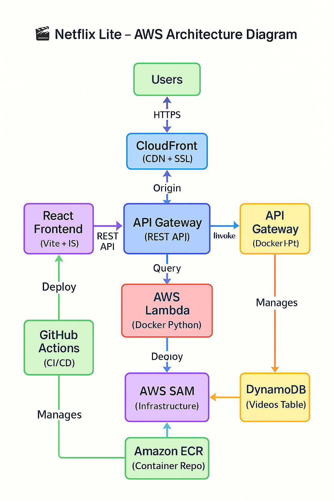

# 🎬 Netflix Lite – Full Stack AWS Streaming App

[](https://github.com/hcky1999/netflix-lite/actions)
[](LICENSE)
[](https://docs.aws.amazon.com/serverless-application-model/)
[](https://vitejs.dev)
[](https://aws.amazon.com/lambda/)

## 🌟 Project Goal
To demonstrate a modern, cloud-native, serverless video streaming app using AWS services. Netflix Lite simulates a simplified streaming backend and frontend stack while following the AWS Well-Architected Framework.

---

## 🚀 Technologies Used

### Frontend Layer
- **React + Vite + Bootstrap** – Modern JS framework with Netflix-style UI
- **Amazon S3** – Static website hosting
- **Amazon CloudFront** – Global CDN with HTTPS enforcement

### API Layer
- **Amazon API Gateway** – REST API interface
- **AWS Lambda** – Serverless compute running Docker container (Python)
- **Amazon ECR** – Container image storage for Lambda

### Data Layer
- **Amazon DynamoDB** – NoSQL database for storing video metadata

### Infrastructure & CI/CD
- **AWS SAM** – Infrastructure as Code (IaC) with CloudFront integration
- **AWS CloudFormation** – Deploy and manage resources
- **GitHub Actions** – Automated CI/CD pipeline with Docker support

### 🐳 Role of Dockerfile
The Dockerfile defines how the backend Python Lambda function is packaged:
```dockerfile
FROM public.ecr.aws/lambda/python:3.11
COPY app/ ${LAMBDA_TASK_ROOT}
COPY requirements.txt .
RUN pip install -r requirements.txt --target "${LAMBDA_TASK_ROOT}"
CMD ["app.lambda_handler"]
```
This ensures dependencies and source code are bundled into a Lambda-compatible container.

---

## 🧭 Architecture Diagram



```
┌─────────────────┐    HTTPS    ┌──────────────────┐
│     Users       │◄────────────┤   CloudFront     │
│                 │────────────►│   (CDN + SSL)    │
└─────────────────┘             └──────────────────┘
                                          │
                                          ▼
                                ┌──────────────────┐
                                │   Amazon S3      │
                                │ (Static Hosting) │
                                └──────────────────┘
                                          │
                                          ▼
┌─────────────────┐             ┌──────────────────┐
│ React Frontend  │────────────►│  API Gateway     │
│ (Vite + JS)     │   REST API  │   (REST API)     │
└─────────────────┘             └──────────────────┘
                                          │
                                          ▼
                                ┌──────────────────┐
                                │  AWS Lambda      │
                                │ (Docker Python)  │
                                └──────────────────┘
                                          │
                                          ▼
                                ┌──────────────────┐
                                │   DynamoDB       │
                                │ (Videos Table)   │
                                └──────────────────┘

┌─────────────────┐             ┌──────────────────┐
│ GitHub Actions  │────────────►│  AWS SAM/CFN     │
│    (CI/CD)      │   Deploy    │ (Infrastructure) │
└─────────────────┘             └──────────────────┘
                                          │
                                          ▼
                                ┌──────────────────┐
                                │   Amazon ECR     │
                                │ (Container Repo) │
                                └──────────────────┘
```

---

## 🔁 Data Flow
1. **User Access**: User requests site → CloudFront (HTTPS) → S3 (React App)
2. **API Calls**: Frontend → API Gateway → Lambda (Docker) → DynamoDB
3. **Response**: DynamoDB → Lambda → API Gateway → Frontend
4. **Deployment**: GitHub Actions → SAM Build → ECR → Lambda + CloudFront update

---

## 💰 Cost Benefits (AWS Free Tier friendly)
- Serverless (Lambda, API Gateway): pay-per-use
- On-demand DynamoDB: No provisioning needed
- S3 + CloudFront: Edge caching & low storage cost
- CI/CD on GitHub: No cost for small usage

---

## ✅ AWS Well-Architected Highlights
- **Operational Excellence**: GitHub Actions CI/CD with automated CloudFront deployment
- **Security**: CloudFront HTTPS enforcement, CORS configuration, IAM least privilege
- **Reliability**: Serverless architecture with managed AWS services
- **Performance**: Global CDN caching, edge locations, serverless scaling
- **Cost Optimization**: Pay-per-use serverless, AWS Free Tier compatible

---

## 📎 Live Demo
🔒 **Secure HTTPS Access**: [Netflix Lite App via CloudFront](https://your-cloudfront-domain.cloudfront.net)

## 🛠️ Quick Start

### Deploy Backend
```bash
cd backend
sam build
sam deploy --parameter-overrides S3BucketName=your-bucket-name
```

### Seed Sample Data
```bash
./scripts/seed-dynamodb.sh
```

### Deploy Frontend
```bash
cd frontend
npm run build
aws s3 sync dist/ s3://your-bucket-name --delete
```

---

© 2025 | Netflix Lite | MIT License
